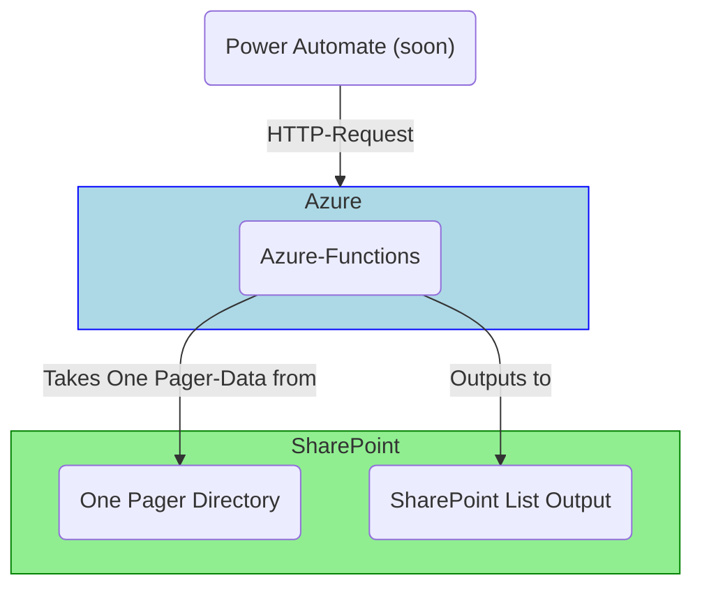

# Azure Functions for OnePager automations

We plan to use Azure Functions to offload complex business logic for e.g. validation 
from Power Automation flows.

## Architecture


## Tools

We recommand you install the following tools to be able to work properly with this
project:

- [Azure CLI][azure-tools-install]
- [Azure Functions Core Tools][core-tools-install]
- Node v22

## Deployment to Azure

### Setup subscription

Create resource group
```bash
az group create --name one-pager --location germanywestcentral
```

enable app insights (e.g. logging)
```bash
az provider register --namespace  Microsoft.OperationalInsights --verbose --wait
```

assign `Storage Queue Data Contributor` role to contributors for queue to be able to see data.

### Configure GitHub OICD access

### Deployment commands

deploy infrastructur
```bash
az deployment group create --resource-group one-pager --template-file infra/main.bicep --parameters functionAppName=poc-one-pager
```

make it small 
```bash
npm prune --production
```

deploy functions
```bash
func azure functionapp publish poc-one-pager
```

## Development

### Run locally

## Running Functions Locally with Azurite

To run your Azure Functions locally and use Azurite for local Azure Storage emulation, follow these steps:


1. **Start Azurite in a subfolder (recommended):**
   ```sh
   npx azurite --location ./.azurite
   ```
   This will store Azurite's data files in the `.azurite` folder in your project root.

2. **Start the Azure Functions host:**
   ```sh
   func start
   ```

Your functions will now run locally and use the Azurite storage emulator.


[azure-tools-install]: https://learn.microsoft.com/en-us/cli/azure/install-azure-cli?view=azure-cli-latest
[core-tools-install]: https://learn.microsoft.com/en-us/azure/azure-functions/functions-run-local?pivots=programming-language-typescript&tabs=macos%2Cisolated-process%2Cnode-v4%2Cpython-v2%2Chttp-trigger%2Ccontainer-apps#install-the-azure-functions-core-tools
