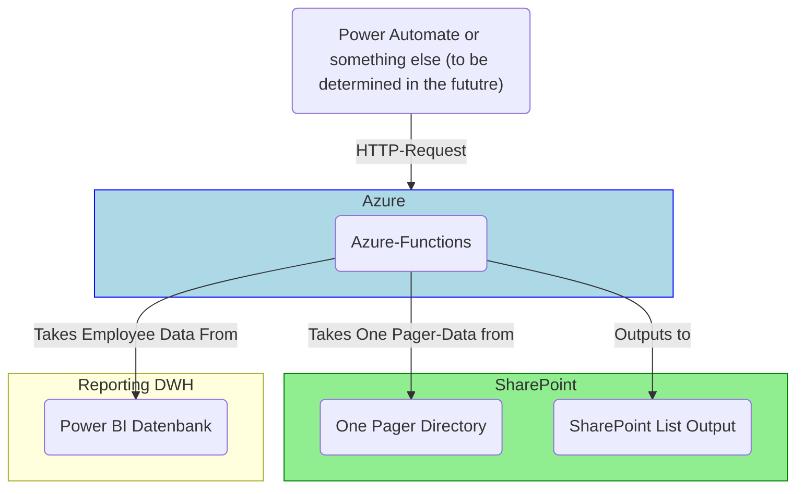

# Development Overview

```mermaid
graph TB
    
    A("Power Automate or something else (to be determined in the fututre)") -- HTTP-Request --> Azure 

    subgraph Azure
        azureFunctions(Azure-Functions)
    end

    subgraph SharePoint
        opOrdner(One Pager Directory)
        ListOutput(SharePoint List Output)
    end

    subgraph Reporting DWH
        powerBIDatabase(Power BI Datenbank)
    end

    azureFunctions -- Takes One Pager-Data from --> opOrdner
    azureFunctions -- Outputs to --> ListOutput
    azureFunctions -- Takes Employee Data From --> powerBIDatabase
    
    style SharePoint fill: lightgreen
    style SharePoint stroke: green
    style Azure fill: lightblue
    style Azure stroke: blue
```