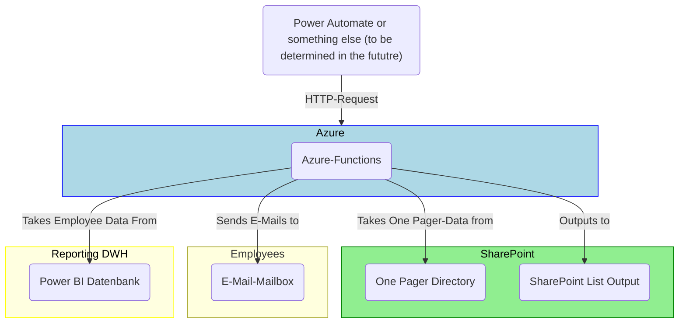
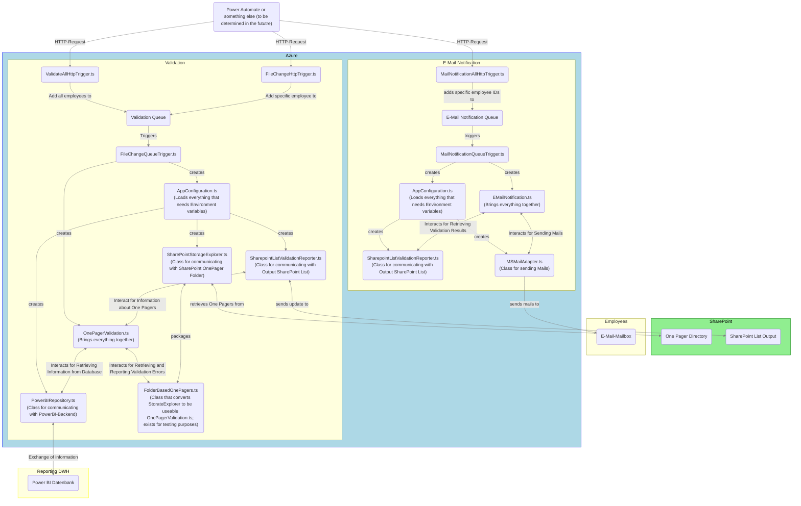
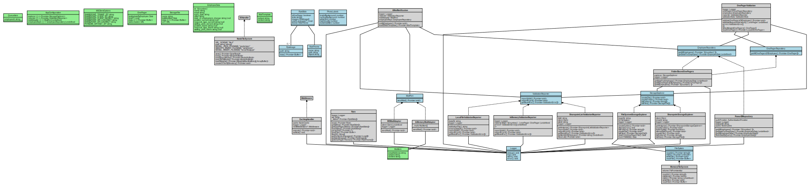

# Architectural Overview
On a global scale, the architecture of this project looks like this:

We have something that triggers our main functions via HTTP request. Our Azure functions do their tasks and use data from different sources. Finally, we write our results in a SharePoint list and maybe send e-mails depending on whether it is time for sending mails.

## Azure Functions
Now, we go into more details about our core functionality. With a bit of abstraction, our code functions like this:

If we include all interfaces and defined global types as well as all classes, we get the following diagram:

(This diagram was created using `azure-functions/experiments/UMLGenerator.ts`.)